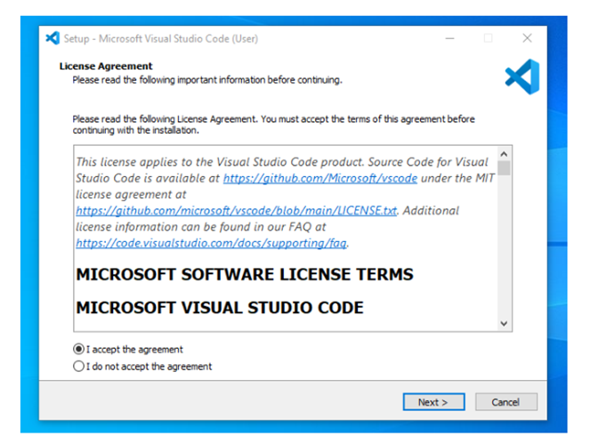
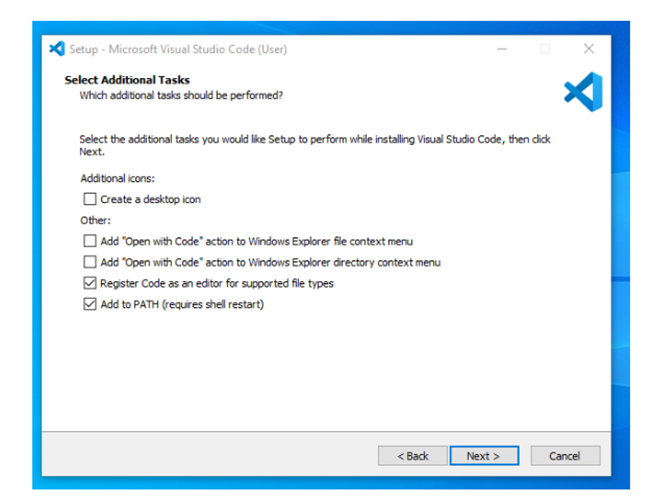
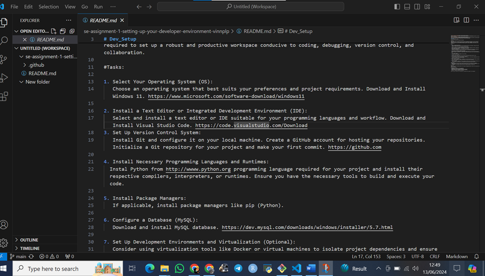
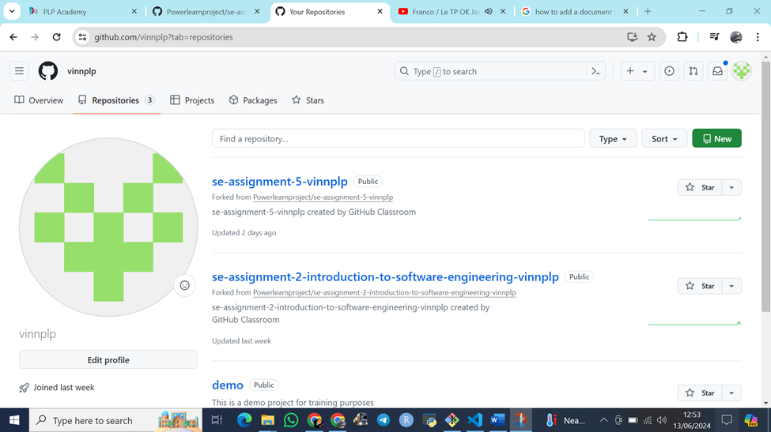
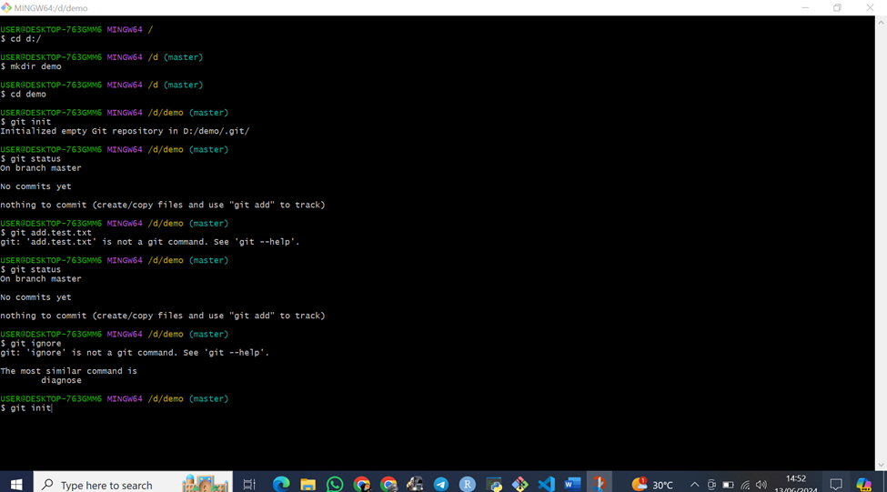
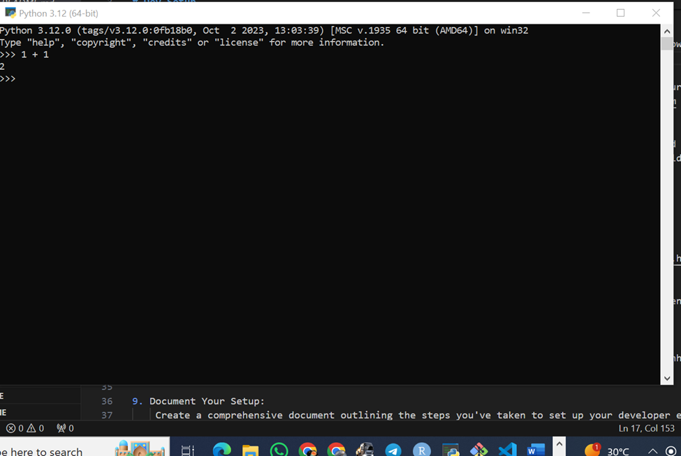
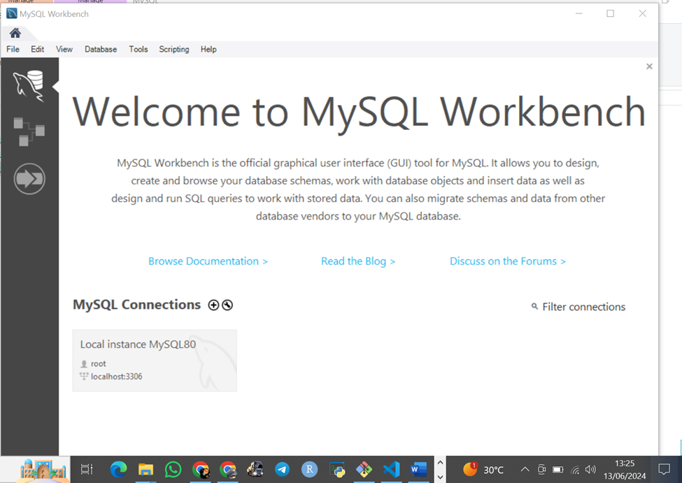

# Dev_Setup
Setup Development Environment

#Assignment: Setting Up Your Developer Environment

#Objective:
This assignment aims to familiarize you with the tools and configurations necessary to set up an efficient developer environment for software engineering projects. Completing this assignment will give you the skills required to set up a robust and productive workspace conducive to coding, debugging, version control, and collaboration.

#Tasks:

1. Select Your Operating System (OS):
   Choose an operating system that best suits your preferences and project requirements. Download and Install Windows 11. https://www.microsoft.com/software-download/windows11

2. Install a Text Editor or Integrated Development Environment (IDE):
   Select and install a text editor or IDE suitable for your programming languages and workflow. Download and Install Visual Studio Code. https://code.visualstudio.com/Download
3. Set Up Version Control System:
   Install Git and configure it on your local machine. Create a GitHub account for hosting your repositories. Initialize a Git repository for your project and make your first commit. https://github.com

4. Install Necessary Programming Languages and Runtimes:
  Instal Python from http://wwww.python.org programming language required for your project and install their respective compilers, interpreters, or runtimes. Ensure you have the necessary tools to build and execute your code.

5. Install Package Managers:
   If applicable, install package managers like pip (Python).

6. Configure a Database (MySQL):
   Download and install MySQL database. https://dev.mysql.com/downloads/windows/installer/5.7.html

7. Set Up Development Environments and Virtualization (Optional):
   Consider using virtualization tools like Docker or virtual machines to isolate project dependencies and ensure consistent environments across different machines.

8. Explore Extensions and Plugins:
   Explore available extensions, plugins, and add-ons for your chosen text editor or IDE to enhance functionality, such as syntax highlighting, linting, code formatting, and version control integration.

9. Document Your Setup:
    Create a comprehensive document outlining the steps you've taken to set up your developer environment. Include any configurations, customizations, or troubleshooting steps encountered during the process. 

#Deliverables:
- Document detailing the setup process with step-by-step instructions and screenshots where necessary.
- A GitHub repository containing a sample project initialized with Git and any necessary configuration files (e.g., .gitignore).
- A reflection on the challenges faced during setup and strategies employed to overcome them.

#Submission:
Submit your document and GitHub repository link through the designated platform or email to the instructor by the specified deadline.

Environment set up assignment 1
1.	Windows installation
My system is not compatible with windows 11 hence and already I had windows 10 installed successfully.
2.	Steps to Install Visual Studio Code on Windows
          Step 1: Visit the Official Website of the Visual Studio Code using any web browser like Google Chrome, Microsoft Edge, etc.
Step 2: Press the “Download for Windows” button on the website to start the download of the Visual Studio Code Application.
Step 3: When the download finishes, then the Visual Studio Code Icon appears in the downloads folder.
Step 4: Click on the Installer icon to start the installation process of the Visual Studio Code.
Step 5: After the Installer opens, it will ask you to accept the terms and conditions of the Visual Studio Code. Click on I accept the agreement and then click the Next button.

 
Step 6: Choose the location data for running the Visual Studio Code. It will then ask you to browse the location. Then click on the Next button. I ticked all the boxes.
 

Step 7: Then it will ask to begin the installation setup. Click on the Install button.
Step 8: After the Installation setup for Visual Studio Code is finished, it will show a window like this below. Tick the “Launch Visual Studio Code” checkbox and then click Next.
Step 9: After the previous step, the Visual Studio Code window opens successfully.
Below is a screenshot of an opened Vs Code
 

3.	My Git and Git hub account
 

 

4.	My installed and running python
 
5.	My SQL database
Download and Install MySQL for Windows Steps
1.	Step 1: Visit the Official MySQL Website.
2.	Step 2: Go to the Downloads Section.
3.	Step 3: Run the Installer.
4.	Step 4: Choose Setup Type.
5.	Step 5: Check Requirements.
6.	Step 6: MySQL Downloading.
7.	Step 7: MySQL Installation.
8.	Step 9: Create MySQL Accountsgit

 

Challenges Faced
1.	Unable to install windows 11 hence opted for already installed windows 10
2.	The challenges faced in installations of various programming language we were able to debug the codes successfully. 
3.	On my end I didn’t face much of the challenges lucky to the chat GPT.

#Evaluation Criteria:**
- Completeness and accuracy of setup documentation.
- Effectiveness of version control implementation.
- Appropriateness of tools selected for the project requirements.
- Clarity of reflection on challenges and solutions encountered.
- Adherence to submission guidelines and deadlines.

Note: Feel free to reach out for clarification or assistance with any aspect of the assignment.
